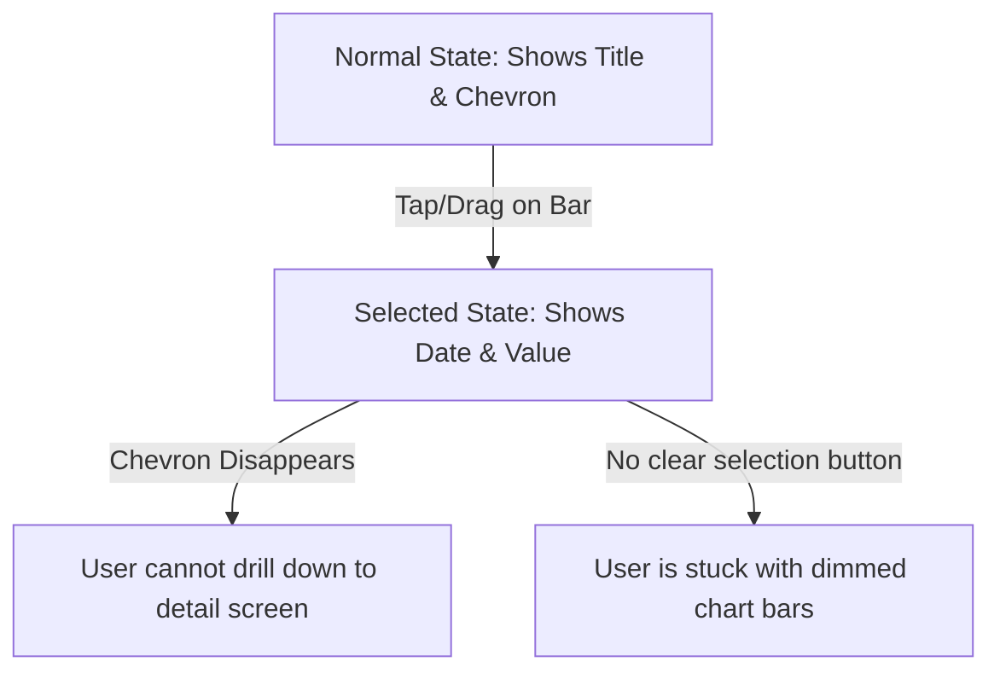

# User Experience Audit & Suggested Improvements: Vitals / Total Calories

This document compiles suggested enhancements for the user experience (UX) of the **Total Calories** (internally **Vitals**) iOS and watchOS applications. These improvements focus on how a user operates, perceives, and navigates the app, aiming to resolve visual friction, cognitive load, and functional gaps.

---

## 1. Branding & Product Naming Alignment

### 🔍 User Experience Friction
When a user downloads the app from the App Store (using the metadata name *"Total Calories"*), they are welcomed by *"Welcome to Total Calories"*. However, as they navigate the app, they encounter references to *"Vitals"* and *"Vitals+"* (e.g., in billing terms, the subscription tab, PDF exports, and settings footers). 

This split branding causes cognitive friction. Users may wonder:
* *Did I download the wrong application?*
* *Is Vitals+ a different service or subscription?*
* *Why does my App Store receipt say "Vitals+" but my home screen icon says "Total Calories"?*

### 🛠️ Codebase Underpinnings
* **Tab Selection & Premium Headers**: In [App.swift](file:///Users/jackwallner/vitals/Vitals/App.swift#L391), the upgrade tab changes label based on subscription status:
  ```swift
  label: store.isPro ? "Vitals+" : "Upgrade"
  ```
  It is also set as the navigation title `navigationTitle("Vitals+")` at [App.swift#L533](file:///Users/jackwallner/vitals/Vitals/App.swift#L533).
* **PDF Title**: In [App.swift](file:///Users/jackwallner/vitals/Vitals/App.swift#L476), the default PDF title is hardcoded to `"Vitals+ Report"`:
  ```swift
  @State private var pdfTitle = "Vitals+ Report"
  ```
* **Store Entitlement**: In [StoreService.swift](file:///Users/jackwallner/vitals/Shared/Services/StoreService.swift#L16), the entitlement identifier is configured as `"Vitals+"`:
  ```swift
  static let proEntitlement = "Vitals+"
  ```

### 💡 Suggested Improvements
1. **Unify the Brand Identity**:
   * If the app is publicly named **Total Calories**, rename the premium tier to **Total Calories Premium**, **Total Calories Pro**, or **Total Calories+** in all user-facing interfaces.
   * If the app is being rebranded to **Vitals**, update the App Store display name, descriptions, and onboarding screens to match.
2. **Decouple Internal Keys from UI Labels**:
   * Keep `StoreService.proEntitlement = "Vitals+"` for RevenueCat/App Store Connect configuration backend stability, but display a localized user-facing name in the UI:
     ```swift
     Text(store.isPro ? "Total Calories Pro" : "Upgrade")
     ```

---

## 2. Onboarding & HealthKit Permission Sequencing

### 🔍 User Experience Friction
During the first-time setup, the user is presented with onboarding slides. When they tap *"Continue"* on page 1, two actions fire simultaneously:
1. The view animates a horizontal transition to step 1 (Goal Setup).
2. A HealthKit authorization prompt is triggered asynchronously.

This results in a visual collision. The system modal dialog slides up *during* the view transition, freezing the animation frame-rate and locking screen input. Furthermore, if a user denies HealthKit permissions, the app silently transitions to the Goals screen and allows them to enter the dashboard, which will appear completely blank and broken with no active feedback.

> [!WARNING]
> Triggering system permissions concurrently with SwiftUI view transitions often causes layout stutters or drops frames, leading to a cheapened first impression.

### 🛠️ Codebase Underpinnings
* **Animation & Prompt Collision**: Inside [DashboardView.swift](file:///Users/jackwallner/vitals/Vitals/Views/DashboardView.swift#L1307-L1320):
  ```swift
  Button {
      step = 1 // Instantly triggers transition animation
      guard !hasRequestedHealthAccess else { return }
      hasRequestedHealthAccess = true
      Task {
          do {
              try await HealthKitService.shared.requestAuthorization() // Launches system modal sheet
          } catch {
              dashboardLogger.error("Onboarding HealthKit auth failed: \(String(describing: error), privacy: .public)")
          }
      }
  } label: {
      primaryLabel("Continue")
  }
  ```

### 💡 Suggested Improvements
1. **Sequence the Permissions Flow**:
   * Change page 1 to be a dedicated "Connect Health" step. When the user taps "Allow Access", trigger the HealthKit request. Wait for the asynchronous call to finish *before* starting the transition animation to step 2 (Goal Setup).
   ```swift
   Button {
       Task {
           if !hasRequestedHealthAccess {
               hasRequestedHealthAccess = true
               try? await HealthKitService.shared.requestAuthorization()
           }
           withAnimation {
               step = 1
           }
       }
   } label: {
       primaryLabel("Allow Access")
   }
   ```
2. **Handle Denial State Gracefully during Onboarding**:
   * Check the authorization status after request. If it was denied, show a helpful alert or screen overlay instructing them how to enable it via `iOS Settings -> Privacy -> Health -> Total Calories` before letting them proceed to a blank dashboard.

---

## 3. Net Deficit & Dietary Data Integration Support

### 🔍 User Experience Friction
**Net Deficit** (Active + Resting Calories Burned minus Dietary Calories Eaten) is a major selling point for the premium tier. However, because the app has no built-in food logging interface, it retrieves dietary energy from Apple Health. 

If a user has not set up a third-party app (e.g., MyFitnessPal, Lose It!, or Cronometer) to sync to Apple Health, their food calories display as `0`. The app handles this with a tiny footnote: 
`"0 food calories logged today. If you’re fasting, this is a valid net deficit day."`

This text is passive and does not help a user who *isn't* fasting but simply doesn't know how to connect their food tracking tools. This leads to confusion, frustration, and increased support requests.

> [!NOTE]
> Net Deficit requires write-permissions from a third-party food tracker into Apple Health, and read-permissions from Total Calories.

### 🛠️ Codebase Underpinnings
* **Fasting Footnote**: The static footnote is defined in [DashboardView.swift](file:///Users/jackwallner/vitals/Vitals/Views/DashboardView.swift#L739-L746):
  ```swift
  } else if foodCalories <= 0 {
      Text("0 food calories logged today. If you’re fasting, this is a valid net deficit day.")
          .font(.system(.caption2, design: .rounded))
          .foregroundStyle(Theme.textTertiary)
          ...
  ```

### 💡 Suggested Improvements
1. **Implement an Interactive Setup Guide**:
   * Instead of a static caption, make this footnote an interactive link or show a button when food calories are `0`:
     ```swift
     Button(action: { showFoodSetupGuide = true }) {
         HStack(spacing: 4) {
             Text("0 food calories logged today. Sync from MyFitnessPal or Lose It! ")
             Image(systemName: "questionmark.circle")
         }
         .font(.system(.caption2, design: .rounded, weight: .semibold))
     }
     ```
   * Open a clean, visually polished bottom sheet with step-by-step illustrations on how to link external apps to Apple Health and enable Health permissions.

---

## 4. Pacing Engine "Cold Start" Transparency

### 🔍 User Experience Friction
When a user enables "Pacing", the dashboard calculates their current progress compared to historical levels at this specific hour of the day. If they lack sufficient historical logs in the lookback window, it displays:
`"Building pace data: X/3 days"`

A new user doesn't understand why the app is "building" data. They may think the app has to run actively in the background for 3 days to record observations. In reality, their Apple Health database might have years of data ready, but the lookback query is restricted, or cached synchronization hasn't completed.

### 🛠️ Codebase Underpinnings
* **Minimum Samples Requirement**: Configured in [GoalSettings.swift](file:///Users/jackwallner/vitals/Shared/Services/GoalSettings.swift#L79-L87) (fixed at 3 days for standard lookbacks).
* **Dashboard Caption**: Rendered in [DashboardView.swift](file:///Users/jackwallner/vitals/Vitals/Views/DashboardView.swift#L951-L954):
  ```swift
  private func pacingBuildingText(samples: Int) -> String {
      let dayWord = pacingMinSamples == 1 ? "day" : "days"
      return "Building pace data: \(samples)/\(pacingMinSamples) \(dayWord)"
  }
  ```

### 💡 Suggested Improvements
1. **Explain the Setup Process**:
   * Provide a clear context label instead of a cryptic loader. For example:
     ```swift
     Text("Analyzing Apple Health history to establish your usual pace (\(samples)/\(pacingMinSamples) days found)...")
     ```
2. **Add a Troubleshooter Callout**:
   * If `samples < pacingMinSamples`, display a small troubleshooting tip: *"Ensure historical calories and steps are recorded in Apple Health for the last few days to generate pacing metrics."*

---

## 5. History Charts Interaction & Navigation Conflict

### 🔍 User Experience Friction
In the **History** tab, users tap and drag on the charts to highlight a specific data point. However, this interaction introduces two significant UX issues:
1. **Hidden Navigation Path**: When a user highlights a bar, the chart card header changes from showing the chart title (e.g., *"Calories"*) with a chevron link to showing the selected date and value (e.g., *"May 15 - 2,450 kcal"*). Crucially, the chevron navigation link (`chevron.right`) disappears. While selection is active, the user *cannot* click the header to drill down into the single-metric detail view.
2. **Missing Dismiss Gestures**: Tapping inside a scrollable chart updates the selection bar. There is no intuitive, clear way to deselect the active bar (other than tapping outside the card, which is often intercepted by the scroll view or is too small to tap).



### 🛠️ Codebase Underpinnings
* **Header Conditional Structure**: In [HistoryView.swift](file:///Users/jackwallner/vitals/Vitals/Views/HistoryView.swift#L2172-L2197):
  ```swift
  if let sel = selection {
      VStack(alignment: .leading, spacing: 4) {
          Text(sel.dateLabel)
          Text(sel.primary.value)
      }
      .transition(.opacity)
  } else if let metricLink {
      NavigationLink(value: metricLink) { // Chevron link only exists in the else-if branch!
          HStack {
              Text(title)
              Image(systemName: "chevron.right")
          }
      }
  }
  ```
* **Chart Opacity Dimming**: Unselected bars dim to `0.3` opacity in [HistoryView.swift#L894](file:///Users/jackwallner/vitals/Vitals/Views/HistoryView.swift#L894):
  ```swift
  .opacity(selectedCalorieDate == nil || Calendar.current.isDate(item.date, equalTo: selectedCalorieDate!, toGranularity: chartDateGranularity) ? 1.0 : 0.3)
  ```

### 💡 Suggested Improvements
1. **Maintain Navigation Affordance during Selection**:
   * Wrap the selected value header block inside the `NavigationLink` so the user can navigate to the detail view regardless of whether a point is highlighted.
     ```swift
     if let sel = selection {
         NavigationLink(value: metricLink) {
             HStack {
                 VStack(alignment: .leading, spacing: 4) {
                     Text(sel.dateLabel)...
                     Text(sel.primary.value)...
                 }
                 Spacer()
                 Image(systemName: "chevron.right")
             }
         }
     }
     ```
2. **Introduce Tap-to-Deselect**:
   * Bind a tap gesture to the chart background that resets `selectedCalorieDate`, `selectedStepDate`, and `selectedNetDate` to `nil` if clicked again. Alternatively, show a small "x" close button next to the selected value readout in the header when a selection is active.

---

## 6. watchOS Navigation & Layout Density

### 🔍 User Experience Friction
On Apple Watch, screen space is extremely limited. The watch app places all enabled metrics (Calories, Steps, Net Deficit, trends, and support actions) in a single, long scrolling view. 

If multiple metrics are enabled, the code scales down the big numbers to a hardcoded size (`28` vs `38`), and spaces components more tightly. This creates visual clutter:
* Stacking multiple text-heavy sections requires excessive scrolling on smaller watch models (e.g., 40mm).
* Text sizes are adjusted using raw values instead of dynamic resizing, which doesn't take advantage of larger screens (like Apple Watch Ultra's 49mm display) and may overlap or truncate on smaller displays.

### 🛠️ Codebase Underpinnings
* **Compact Layout Threshold**: Defined in [TodayView.swift](file:///Users/jackwallner/vitals/VitalsWatch/Views/TodayView.swift#L57-L63):
  ```swift
  private var compactLayout: Bool {
      let visibleCount = (goals.showCalories ? 1 : 0)
          + (goals.showSteps ? 1 : 0)
          + (goals.showNetCalories ? 1 : 0)
      return visibleCount >= 2
  }
  ```
* **Scroll View Layout**: In [TodayView.swift](file:///Users/jackwallner/vitals/VitalsWatch/Views/TodayView.swift#L74-L247), everything is packed vertically inside a single `ScrollView` + `VStack(spacing: compactLayout ? 6 : 12)`.

### 💡 Suggested Improvements
1. **Adopt a Page-Based `TabView` Layout**:
   * Rather than a single long scrolling column, partition the metrics and trends into horizontally swipeable pages using `.tabViewStyle(.page)`.
   * **Page 1**: Core Progress Rings and metrics (Calories, Steps, Net Deficit).
   * **Page 2**: Historical Trend Analysis graphs and metrics comparisons.
   * **Page 3**: App Information, Settings, and Health Sync statuses.
2. **Utilize Dynamic Type and Case Sizes**:
   * Instead of manual point size toggling (`compactLayout ? 28 : 38`), let watchOS scale fonts naturally using system design elements:
     ```swift
     .font(.system(.title, design: .rounded, weight: .bold))
     ```
   * Or inspect container sizes via `GeometryReader` to scale typography proportionally to the screen size.
